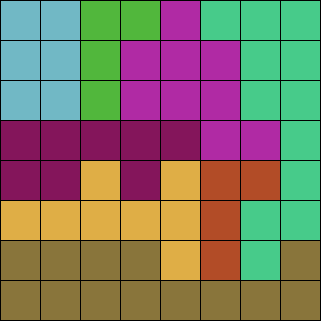

Generator for [trees logic puzzles](https://www.sporcle.com/playlists/SporcleEXP/trees-logic-puzzles).

Requires [Uiua](https://uiua.org) v0.10.

Below is an example puzzle.



The rules are as follows:
- Each square either contains a "tree" or does not contain a tree (there is no significance to the object in question being a "tree," it is really just an arbitrary object occupying one cell).
- Every row, every column, and every colored region contains *exactly one* tree.
- Two trees cannot be adjacent to each other, even diagonally.

Since this specific puzzle is 8x8, there are a total of 8 trees; solve the puzzle by finding them.

## Example usage
Generate an 8x8 puzzle and play it with the app.
```bash
uiua gen.ua 8
uiua app.ua
```

## Generate
Generates an NxN puzzle and writes it to `file`.
- `N` defaults to `5`
- `file` defaults to `out.csv`
```bash
uiua gen.ua [N] [file]
```

## Play using interactive app
Requires [raylib](https://github.com/raysan5/raylib) pointed to by
`RAYLIB_PATH`.
Starts the interactive app with the puzzle in `file`.
- `file` defaults to `out.csv`
```bash
uiua app.ua [file]
```
In the app, left/right click on squares to cycle between eliminated
(`-`) and tree (`T`). Press space to reroll the colorscheme.

## Generate an image
If `img` is provided, outputs a png of the puzzle in `puz` to the filename `img`.

Otherwise, outputs an image of the puzzle in `puz` to the terminal.
- `puz` defaults to `out.csv`
```bash
uiua img.ua [puz] [img]
```
